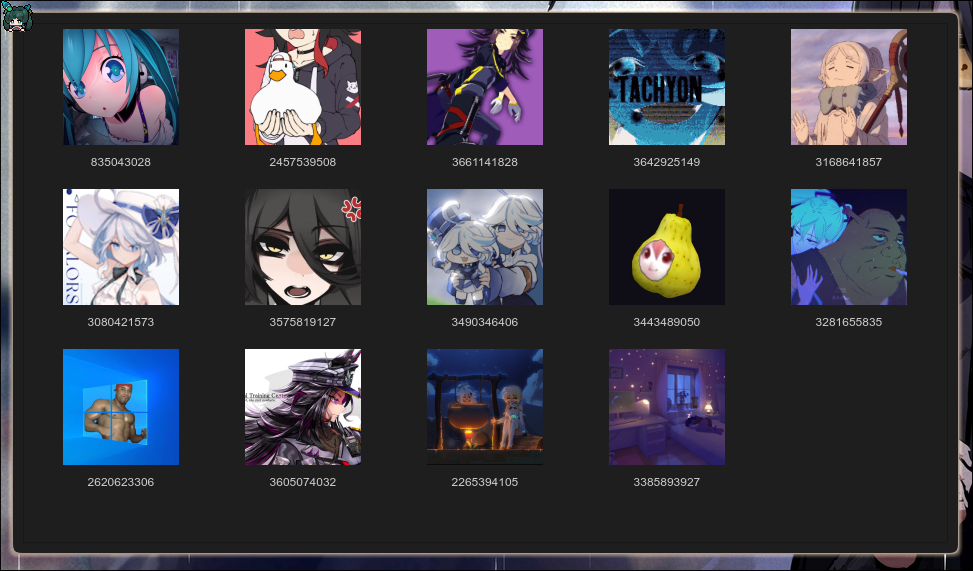

<div align="center">

# 🖼️ linux-wallpaperengine-gui

**Minimalist GUI client for [linux-wallpaperengine](https://github.com/Almamu/linux-wallpaperengine/)**

[🇷🇺 Read in Russian](./README-RU.md)


<br>



</div>

---

## 📖 About

`linux-wallpaperengine-gui` is a simple and unobtrusive graphical interface for managing live wallpapers through the `linux-wallpaperengine` library.

The application is designed to **stay out of your way**: it launches directly to the system tray, automatically loading the last used wallpapers. The main window opens only on demand (via tray context menu -> *Show Window*).

---

## ⚠️ Important Notice (Current Status)

> **🚧 The project is temporarily archived and unfinished.**
> 
> This is because the base library (`linux-wallpaperengine`) it's built upon is also under active development and has several critical issues:
> - **FFmpeg errors:** There are noticeable problems when loading and rendering `VIDEO` type wallpapers.
> - **Incomplete SCENE support:** `SCENE` type wallpapers work incorrectly or don't support some features.
> 
> Due to these backend limitations, it's currently impossible to implement the planned functionality in full.
> 
> **Future plans:** Once the library is completed or the above issues are fixed, the project will be unfrozen. Plans include: adding scripting support, integration with `pywal` for automatic theme switching, and overall UI polish.

---

## 🚀 Installation and Usage

### Installation
1. Clone the repository:
   ```bash
   git clone https://github.com/Dimidroll06/linux-wallpaperengine-gui.git
   cd linux-wallpaperengine-gui
   ```
2. Install dependencies (using a virtual environment is recommended):
   ```bash
   pip install -r requirements.txt
   ```

### Running
The main entry point is `main.py`:
```bash
python main.py
```
After launch, the icon will appear in the system tray. Right-click it and select **Show Window** to open settings.

### 🔄 Autostart (Recommended)
Since the application needs to preload wallpapers in the background, it's **highly recommended to add it to autostart** of your window manager or desktop environment.

**For Hyprland:**
Add to `~/.config/hypr/hyprland.conf`:
```ini
exec-once = /path/to/venv/bin/python /path/to/linux-wallpaperengine-gui/main.py
```

**For Sway:**
Add to `~/.config/sway/config`:
```text
exec /path/to/venv/bin/python /path/to/linux-wallpaperengine-gui/main.py
```

**For GNOME / KDE / XFCE:**
Add the command `python /path/to/main.py` to the "Startup Applications" (Autostart) section in your environment settings.

---

## 📂 Project Structure

```text
├── LICENSE                 # GPL-3.0 License
├── main.py                 # Application entry point
├── pyrightconfig.json      # Type checker configuration
├── README.md               # This file
├── README-RU.md            # Russian version
├── requirements.txt        # Python dependencies
└── src
    ├── config.py           # Global configurations and paths
    ├── controllers/        # Controllers (UI-logic bridge)
    ├── core/               # Application core
    │   ├── lib.py          # Wrapper over linux-wallpaperengine
    │   └── state_manager.py# State management (save/load)
    ├── gui/                # Graphical interface (PyQt6)
    │   ├── application.py  # QApplication initialization
    │   ├── main_window.py  # Main settings window
    │   ├── tray.py         # System tray logic
    │   ├── resources/      # Resources (icons, styles)
    │   │   ├── icon512.png
    │   │   ├── icon.png
    │   │   └── style.qss   # Qt stylesheet
    │   └── widgets/        # Custom widgets
    │       └── wallpaper_grid.py # Wallpaper preview grid
    ├── models/             # Data models (Pydantic/Dataclasses)
    │   └── wallpaper.py    # Wallpaper structures and properties
    └── utils/              # Utility functions
        ├── singleton.py    # Singleton pattern
        └── wallpaper_loader.py # Wallpaper metadata loader
```

---

## 🗺️ Roadmap (Plans after unfreezing)

- [ ] **Scripting:** Support for executing user scripts inside SCENE type wallpapers.
- [ ] **Pywal integration:** Automatic extraction of color palette from current wallpapers and applying it system-wide.
- [ ] **VIDEO fix:** Full support for video wallpapers after fixing FFmpeg bugs in the upstream library.
- [ ] **UI/UX:** Improve preview grid, add loading progress bars, and more flexible property configuration (sliders, colors).

---

## ⚖️ License

This project is distributed under the **GNU General Public License v3.0 (GPL-3.0)**.
This license was chosen because the project is built on top of the `linux-wallpaperengine` library, which is also distributed under GPL-3.0.

See the [LICENSE](./LICENSE) file for details.
